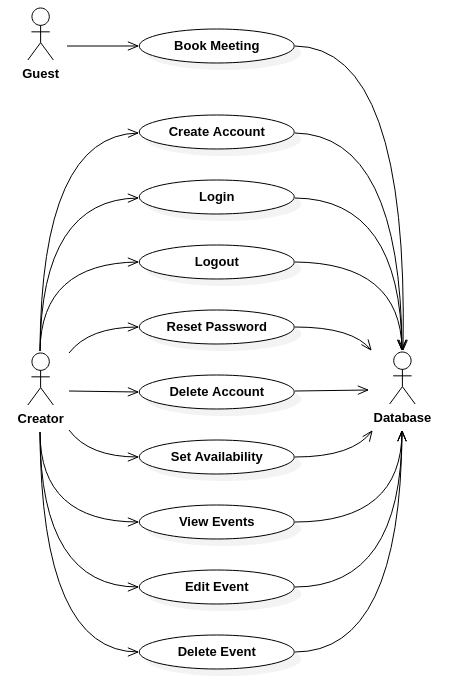

# Appointment Creator

## Problem Statement

There is no easy way to create time for people to schedule appointments through google calendars. 

## Project Objective

The goal of this is to create a dedicated interface for scheduling appointments.

## Contributors

* dkiskamp
* AZMSE
* isaaccmcd
* saimayunus925

## Requirements
**Nonfunctional Requirements:**

1. The system displays messages in English.
2. The system responds to both creator and guest's command within a few seconds.
3. The app must run on Internet Explorer, Firefox, and Chrome.
4. The app will work Google Calendars.

**Functional Requirements:**

1. The buttons, such as "Create Account", "Login", "Logout", "Reset Password", "Delete Event" should execute promptly. 
2. The appointment time should be accurate and updated.
3. The availble time frames should be able to select and make appointment.
4. The unavailable time frames should not be an option to pick.
5. Reminders should be sent to guest through email prior to their scheduled time frame.
6. Calender should be presentable monthly, weekly, and in chosen day.

## Use Cases

## Create Account

**Summary:** A creator can create a new account.

**Actors:** The creator and server.

**Pre-Conditions:** 

* The creator doesn’t have an account.
* No one is logged in on the creator's browser.

**Trigger:** The creator clicks register.

**Primary Sequence:** 

1. The system prompts the creator for a username, password, and email.
2. The creator provides a username, password, and email.
3. The system stores the data on the server.
4. The creator is now logged in.

**Alternative Sequence:**

2. Username is already in use.

   a. The system displays an error message.

   b. The system prompts the creator for a new username.

2. Email is already in use.

   a. The system displays an error message for the creator.

   b. The system prompts the creator for a different email.

**Post-Conditions:**

* A new account is made.
  * Account information is stored on the server.
  * The creator is able to login.

**---OR---**

* A new account is not made.
  * No data is stored on the server.
  * The creator does not have login information.

## Login

**Summary:** A creator enters their login credentials to access their account.

**Actors:** The creator and server. 

**Pre-Conditions:** 

* The creator must have previously made an account.
* No one can be logged in on the creator's browser.

**Trigger:** The creator selects the login button.

**Primary Sequence:**

1. The system prompts the creator to enter their username and password.
2. The creator enters their username and password.
3. The system checks the server if the username and password are correct.
4. The creator is logged in.

**Alternative Sequence:**

2. The creator enters a wrong username or password.

   a. The system displays an error message for the creator.

   b. The system prompts the creator to try again.

**Post-Conditions:**

* The creator is logged in.

**---OR---**

* The creator is not logged in.

## Logout

**Summary:** A creator logs out of their account.

**Actors:** The creator and server.

**Pre-Conditions:**

* The creator is logged on.

**Trigger:** The creator selects the logout button.

**Primary Sequence:**

1. The system clears the credentials from the browser.

**Post-Conditions:**

* The creator is logged out.

## Reset Password

**Summary:** A creator who has forgotten their password can reset it.

**Actors:** The creator and server

**Pre-Conditions:**

* The creator is logged on.

**Trigger:** The creator selects the reset password button.

**Primary Sequence:**

1. The system prompts the creator to enter their username.
2. The system checks the server for a matching username.
3. An email is sent to the address associated with the username. 
4. The creator opens the email and clicks the reset password link.
5. The system prompts the customer to enter a new password.
6. The system prompts the customer to re-enter the password.
7. The system checks if the password match.
8. The system updates the creator's password in the server.

**Alternative Sequence:**

7. The passwords do not match.

   ​	a. The system displays an error message for the creator.

   ​	b. The system prompt the creator to try again.

**Post-Conditions:**

* The creator's password has been changed

**---OR---**

* The creator's password remains the same.

## Delete Event

**Summary:** A creator can delete an upcoming event.

**Actors:** The creator, guest, and system.

**Pre-Conditions:**

* An event must be selected.

**Trigger: **The creator selects delete event.

**Primary Sequence:**

1. The system prompts the creator to confirm deleting the event.
2. The system removes the event from the schedule.
3. The system reopens the time slot the deleted event was to take place.
4. An email is sent to the guest that booked the event.

**Alternative Sequence:**

1. The creator declines the confirmation for deleting the event.

   ​	a. The event is not removed from the schedule.

**Post-Conditions:**

* The desired event has been deleted from the schedule.
  * The time slot becomes open for guests to book.

**---OR---**

* The event is not deleted from the schedule.
